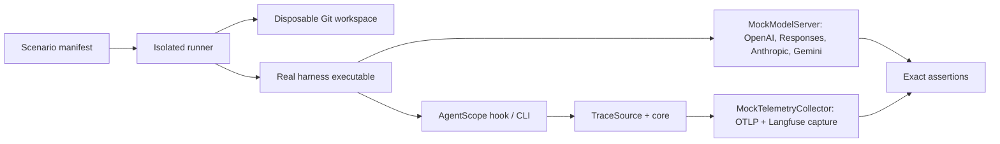

## Terminology

An **agent harness** is the end-user agent runtime—Codex, Claude Code, Gemini CLI, OpenCode, Pi, OpenClaw/CLAW, or Hermes—not the LLM provider behind it. The test system treats its configuration, command line, native artifacts, hook lifecycle, and endpoint protocol as one harness adapter.

## Concrete architecture



`@agentscope/testkit` owns reusable infrastructure. Harness packages contribute only a versioned command/configuration recipe and native expectation mapping. Each scenario specifies a harness/version, disposable `HOME` and Git workspace, mock-model protocol and dummy key, bounded non-interactive command, expected model requests, expected native artifacts, and expected normalized/reporter payloads.

The runner exposes mock services on ephemeral loopback ports. No test accesses a developer's real home, credential store, vendor account, or Langfuse project.

## Scenario contract

Each harness package supplies a typed `HarnessScenario`, not an ad-hoc shell script:

```ts
{
  id: "codex-basic-turn",
  harness: "codex",
  command: "codex",
  args: ["exec", "--json", "--cd", workspace, "reply MOCK_OK"],
  cwd: workspace,
  env: { CODEX_HOME: isolatedHome, AGENTSCOPE_MOCK_MODEL_URL: modelUrl },
  expect: {
    exitCode: 0,
    modelPaths: ["/v1/responses"],
    telemetryPaths: ["/v1/traces"],
  },
}
```

The generic runner executes the real child process with a timeout; a harness adapter prepares configuration and then validates the request ledgers against `expect`. This gives every harness the same reporting assertions while leaving its native configuration format private to its package.

## Compatibility matrix

| Harness         | Deterministic model route                                                     | Test lane                    |
| --------------- | ----------------------------------------------------------------------------- | ---------------------------- |
| Codex           | Controlled test profile; probe supported custom/OSS gateway route per version | Real CLI once verified       |
| Claude Code     | Anthropic-compatible LLM gateway/proxy                                        | Real CLI                     |
| Gemini CLI      | `GOOGLE_GEMINI_BASE_URL` to the Gemini mock                                   | Real CLI                     |
| OpenCode        | Custom OpenAI-compatible provider `settings.baseURL`                          | Real CLI                     |
| Pi              | Custom provider/extension `baseUrl`                                           | Real CLI                     |
| OpenClaw (CLAW) | Headless `openclaw agent exec --local` with isolated provider config          | Real CLI                     |
| Hermes          | Isolated provider/model config and pinned container image                     | Real CLI after adapter lands |

If an upstream release removes its documented endpoint override, the harness/version is marked unsupported and its scenario fails with an actionable compatibility error. It never silently falls back to a replay fixture.

## Options evaluated

| Option                        | Decision                                                                 |
| ----------------------------- | ------------------------------------------------------------------------ |
| Transcript replay only        | Keep for source unit tests; insufficient for hooks or real CLI behavior. |
| One universal OpenAI mock     | Rejected: hides Anthropic, Gemini, and Responses protocol drift.         |
| Separate mock per harness     | Rejected: duplicated server and assertion logic.                         |
| Protocol-multiplexing mock    | Chosen: deterministic slices of each protocol, one request ledger.       |
| Paid vendor accounts in PR CI | Rejected: non-hermetic, costly, and unsafe for forks.                    |
| Docker/OCI harness images     | Chosen for CI reproducibility; local runner may use installed binaries.  |
| VM per harness                | Deferred: only for OS/keychain behavior containers cannot exercise.      |

## Local and CI operation

```bash
pnpm test:unit
pnpm test:integration
pnpm test:integration -- --harness codex
pnpm test:integration -- --scenario tool-call
```

`test:unit` contains only deterministic code tests. `test:integration` starts mocks, creates isolation, and runs selected real harnesses. Local binary/version probing gives an explicit skip for optional missing harnesses. CI pins required harness images; scheduled compatibility runs exercise the full version matrix and capture logs, generated hook configuration, transcripts, model requests, and telemetry requests on failure.

The protected live Langfuse smoke remains a separate manual/scheduled environment test. It proves real destination delivery only after the local mock suite passes.

## Adding a harness

Add `@agentscope/harness-<id>` and a testkit manifest implementing `detect`, `prepare`, `invoke`, `collectNativeArtifacts`, and `expect`. It must prove reversible installation, mock model traffic, branch/worktree capture, model/tool/error normalization, retry deduplication, and clean uninstall. The detailed implementation backlog is in the Beads **Agent harness integration test platform** epic.
