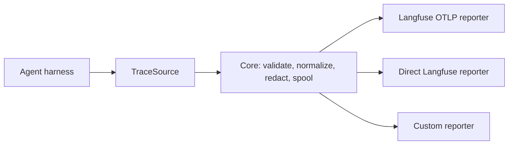

## Decision

AgentScope uses two extension points:

```ts
interface TraceSource<TEvent> {
  id: string;
  collect(input): Promise<TraceBatch<TEvent>>;
}

interface TraceReporter<TEvent> {
  id: string;
  report(batch: TraceBatch<TEvent>): Promise<TraceReportReceipt>;
}
```

A harness adapter invokes a `TraceSource`; a destination package implements a `TraceReporter`. Core owns the versioned batch envelope, normalization, redaction, idempotency keys, retry classification, and spool policy. This makes `@agentscope/reporter-langfuse` an implementation, not a special case baked into every harness.



## Two Langfuse paths

The first reporter maps to OTLP so a mock collector can verify resource spans exactly. A future direct Langfuse reporter may use the Langfuse ingestion API where that models a feature more faithfully. Both consume the same normalized batch and share idempotency and redaction rules. A harness never decides which reporter is active.

## Contract testing

Every reporter runs the same testkit suite: rejected payload behavior, retryability, idempotency, timestamps, redaction, parent-child span structure, model usage, Git metadata, and graceful shutdown. Every source runs deterministic extraction and explicit unknown/unavailable-field tests with no destination I/O.
