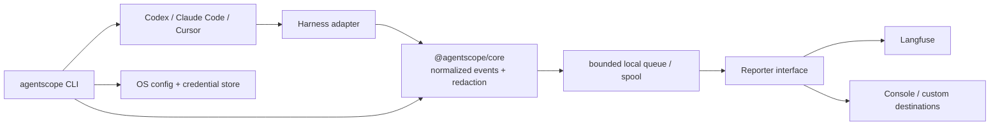

# AgentScope architecture blueprint

## Proposed architecture



## Package boundaries

| Package                  | Responsibility                                                         | Must not own                               |
| ------------------------ | ---------------------------------------------------------------------- | ------------------------------------------ |
| `@agentscope/core`       | Event contracts, redaction, queue lifecycle, reporter contract, SDK    | provider hook mutation or destination SDKs |
| `@agentscope/cli`        | Config, credentials, lifecycle, diagnostics, installation transactions | parsing provider transcripts               |
| `@agentscope/harness-*`  | Provider configuration and trace extraction                            | reporter-specific mapping                  |
| `@agentscope/reporter-*` | Convert normalized events to a destination protocol                    | provider-specific files or hook mutation   |
| `@agentscope/testkit`    | Contract fixtures, fake collector, assertions                          | production configuration                   |

## CLI contract (initial)

```text
agentscope init
agentscope configure reporter langfuse
agentscope install codex
agentscope status
agentscope doctor
agentscope capture replay <fixture>
agentscope uninstall codex
```

`init` creates the global config directory and selects a reporter. `install` detects an existing provider installation, writes a reversible hook configuration transaction, and records the provider version. A hook invokes the stable CLI executable rather than embedding implementation code in provider config.

## Effective Git context resolution

Hook processes commonly inherit the coding agent's active shell working directory. SF Platform's Codex and Claude Code integration tests confirm that this can be a subdirectory and can be inside a fresh Git worktree, so AgentScope must **not** assume the hook's launch path is always the repository root. Provider payloads may also expose a more authoritative workspace path.

For every completed turn, the harness resolves workspace context in this order:

1. Explicit workspace/cwd supplied by the lifecycle hook payload.
2. Workspace/cwd associated with the provider-native session record or transcript.
3. The hook process `process.cwd()` as a final fallback.

It then executes Git against the resolved candidate (never changes the global process directory):

```text
git -C <candidate> rev-parse --show-toplevel
git -C <candidate> branch --show-current
git -C <candidate> rev-parse HEAD
```

The resulting `repository_root`, `worktree_root`, `branch`, `commit`, and `context_source` travel in normalized trace metadata and each reporter receives them after redaction. In a detached worktree, `branch` is `undefined` and `git_state` is `detached`; outside Git or on command failure, `git_state` is `unavailable`. The runner must preserve the exact active worktree—never resolve via `--git-common-dir`, which would lose the branch selected by that worktree.

The test matrix includes root, nested directory, explicitly supplied workspace, detached worktree, non-Git directory, and Git-unavailable cases. This parity requirement is inherited from SF Platform's current hook tests, which exercise subdirectory and fresh-worktree execution.

## SF Platform parity baseline

The initial migration target is parity with the copied framework source, before expansion:

- Codex, Claude Code, and Cursor native discovery and transcript parsing.
- Stable normalized provider/session/turn/message records with original timestamps and raw-source pointers.
- Model provider/name/reasoning-effort and usage metadata; tool calls/results, shell activity, file edits, thinking, skills, and child-agent relationships.
- Native-turn slicing, trace-to-code attribution records, skill-read replay-safe spool behavior, and deterministic provider fixtures.
- Fail-open lifecycle invocation, idempotent turn export, redaction before spooling/reporting, and destination-neutral reporter planning.

New features must add adapter fixtures and cross-reporter contract tests; they may not regress a copied SF Platform behavior without a documented migration.

## Reporter plugin interface

The stable v1 interface should be intentionally small:

```ts
export interface Reporter {
  readonly id: string;
  initialize(context: ReporterContext): Promise<void>;
  report(batch: AgentScopeEvent[]): Promise<ReportResult>;
  shutdown(): Promise<void>;
}
```

Reporters receive events only after core validation and redaction. Retry classification, backpressure, dead-letter policy, and idempotency keys remain owned by core so all destinations behave predictably.

## Langfuse compatibility boundary

Langfuse's official Codex and Claude Code plugins are the reference behavior for their own destination: they run a Stop hook, read the provider transcript, emit a session-grouped turn hierarchy, backdate observations, and maintain state to prevent duplicate uploads. AgentScope should use these as compatibility requirements, not as a code dependency or a second hook to run in parallel.

When `@agentscope/reporter-langfuse` is active, the rendered hierarchy is:

```text
session
└── turn trace / agent observation
    ├── model generation (input, output, usage, reasoning summary)
    │   └── tool spans (input, output, status, duration)
    └── child-agent turn traces
```

The CLI detects the official plugin/configuration during `install` and `doctor`. The default action is a non-destructive conflict report with migration instructions; only an explicit `agentscope install <harness> --replace-langfuse` may disable or replace the overlapping hook. Test fixtures must include conflict detection, migration rollback, duplicate prevention, layered config precedence, and fail-open behavior.

## Integration-test blueprint

AgentScope calls end-user agent runtimes **agent harnesses**. Model providers are a separate concern; an agent harness may use any provider or API shape and must still reduce to the same AgentScope primitives.

1. **Contract tests:** fast unit tests for schema, redaction, queues, and reporter semantics.
2. **Adapter fixtures:** checked-in, sanitized native artifacts for each supported harness and version family.
3. **Container matrix:** Docker Compose launches a mock collector and an integration runner. The runner creates a temporary home/config directory, installs the built CLI, executes each harness fixture, then asserts captured normalized and reporter payloads.
4. **Real CLI installation tests:** test hook installation with disposable configuration directories. Never modify a developer's real provider settings.
5. **Live smoke test:** scheduled/manual workflow uses a protected GitHub Environment, sends one synthetic trace to Langfuse, and verifies receipt by API. It is never a pull-request gate.
6. **Compatibility fixtures:** sanitized transcript fixtures verify that the Langfuse reporter produces one session grouping, one idempotent turn hierarchy, accurate timestamps, model usage, tool status, and subagent nesting without the official plugin or a live Langfuse project in CI.

Docker is preferred to a dedicated VM for v1 because the fixtures are file/process driven and must be reproducible in CI. Add a macOS runner only after a provider exposes functionality unavailable in Linux containers.

## Real agent-harness test platform

The integration suite is not only a transcript replay suite. A testkit scenario runs the real harness executable with an isolated home/config directory, a disposable Git workspace, and ephemeral loopback mock services. `MockModelServer` multiplexes minimal deterministic OpenAI Chat Completions, OpenAI Responses, Anthropic Messages, and Gemini GenerateContent protocol responses, recording every request. `MockTelemetryCollector` records OTLP/Langfuse delivery requests. The scenario asserts the harness contacted the expected model protocol, AgentScope captured its native lifecycle/artifact output, and the reporter emitted the expected normalized hierarchy.

The platform is deliberately layered: `@agentscope/testkit` owns servers, isolation, manifests, and generic assertions; each `@agentscope/harness-*` package contributes a small versioned adapter for detection, setup, invocation, artifact collection, and expectations. This prevents per-harness Docker scripts from becoming independent test frameworks.

The repository exposes the protected suite as `pnpm test:integration:live` in
the `@agentscope/integration-live` workspace. Its GitHub workflow runs only by
schedule or manual dispatch under the `langfuse-live` Environment; it receives
the public/secret keys as Environment secrets and the base URL as an
Environment variable. Until `@agentscope/reporter-langfuse` is implemented,
the entry point deliberately validates that protected configuration is present
instead of pretending to prove delivery. The reporter slice upgrades this same
command to send and retrieve one synthetic redacted trace.

## Delivery slices

1. Establish package builds and migrate source with parity tests.
2. Implement the CLI config/credential and transaction layer.
3. Extract first Codex harness and console reporter; complete the local Docker test path.
4. Add Langfuse, Claude Code, and Cursor adapters with fixture coverage.
5. Stabilize plugin ABI and publish public packages.
